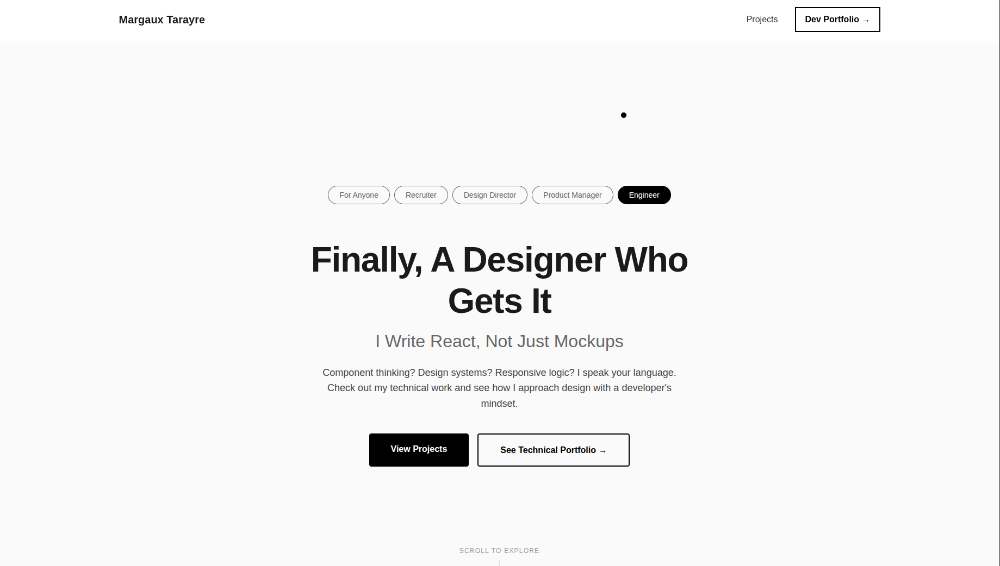

# Margaux Tarayre - UX/UI Designer & Developer

**UX/UI Designer & Frontend Developer in training**

A React portfolio showcasing my journey from development to UX/UI design. Currently learning and building projects that bridge both worlds.

## 🎯 About Me

Frontend developer transitioning into UX/UI design. Passionate about creating user-centered interfaces that are both beautiful and functional.

## 🔧 Technical Skills

- **Frontend:** React, JavaScript, HTML/CSS
- **Design:** Figma, User Research, Wireframing
- **Tools:** Git, Vite, npm

## 📁 Projects Included

- **Celeste's garden** - E-commerce figma design
- **Campus Sortie** - User research & mobile app design
- **Evasion** - fictive design thinking

## 🚀 Live Demo

https://margaux-tarayre-ux-portfolio.netlify.app/
